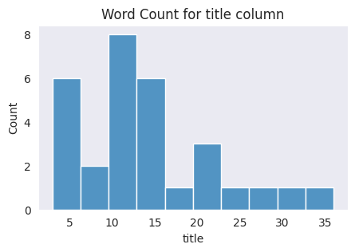
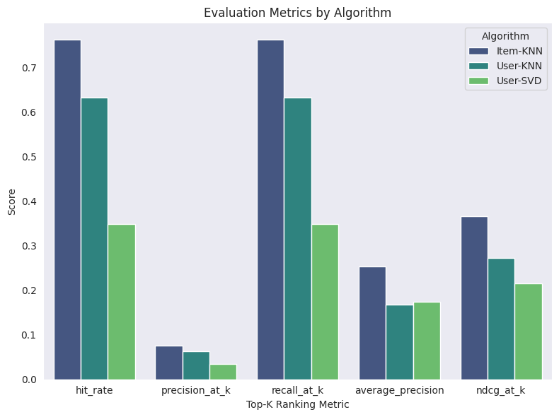

# AgentRex: Multi-Strategy E-Commerce Recommendation Engine

*In the dynamic landscape of e-commerce and retail, recommendation systems are integral to enhancing customer experiences and fostering business growth.*

*As consumers navigate millions of online products, they often encounter information overload, which complicates the process of identifying items that align with their interests. The primary challenge is effectively filtering this abundance of information while delivering personalized recommendations that are relevant, engaging, and tailored to individual preferences. The ability to quickly provide relevant and personalized suggestions is not only a technical challenge but also a critical competitive advantage.*

*Recommendation engines address this need by generating personalized product suggestions based on user behavior, preferences, item attributes, and various other factors. These systems are extensively utilized in the retail sector to enhance customer engagement, elevate average order values, and improve conversion rates. Prominent companies, such as Amazon and Walmart, leverage sophisticated recommendation algorithms to optimize inventory turnover and maximize revenue per user.*

*This capstone project focuses on the development and evaluation of a multi-strategy recommendation engine utilizing real-world data. It encompasses the complete process—from data preprocessing and exploratory data analysis to model selection, evaluation, and optimization—highlighting the practical application of machine learning techniques in the creation of advanced recommendation engines.*

---
## 1. Data

**Objectives:**

The project focuses on creating a multi-strategy recommendation engine that leverages machine learning algorithms to provide personalized recommendations. The main objectives are to:

- Improve the accuracy of predicting user preferences by using advanced algorithms such as collaborative filtering, content-based filtering, or hybrid approaches.

- Develop methods to address the cold-start problem for both new users and new items.

**Scope of Solution Space:**

<!-- Similar to a hybrid recommender system multi-strategy combines multiple recommendation techniques to improve accuracy, overcome limitations of individual methods, and enhance user experience. 

A multi-strategy recommender engine:*
- Leverages multiple algorithms (CF, CBF, popularity, etc.)
- Increases recommendation robustness and personalization
- Helps overcome cold start, sparsity, and overfitting
- Can be tuned dynamically based on use case and user feedback

Unlike the hybrid recommenders which are tightly coupled models and methods, A multi-strategy recommender emphasizes loosely-coupled, independent models where different the algorithms operate independently, with the methods being modular, and with their results that can be strategically combined -->

The proof of concept (POC) will be developed using Jupyter Notebooks until we achieve optimal model performance.

It's important to clarify that this project does not include the development of any front-end components for an eCommerce website. The next step, which involves integrating the model into an eCommerce platform, should be planned as a separate project.

**Data Source:** [UCSD Amazon Reviews 2023 | McAuley Labs](https://amazon-reviews-2023.github.io/)

The dataset includes a large collection of user reviews, product metatdata, and product links collected in 2023 by [McAuley Lab](https://cseweb.ucsd.edu/~jmcauley/)\
Detailed description of the fields can be found in the aforementioned link.\
Due to technical resource constraints, only the appliances data were extracted and further resampled for this analysis. The notebook extracts the appliances json files from the following URLs:

[Amazon Users Reviews](https://mcauleylab.ucsd.edu:8443/public_datasets/data/amazon_2023/raw/review_categories/Appliances.jsonl.gz)\
[Appliances Metadata](https://mcauleylab.ucsd.edu:8443/public_datasets/data/amazon_2023/raw/meta_categories/meta_Appliances.jsonl.gz)

A user-defined function reads the json files in manageable chunks, samples and combines them. There is also an option to read json files uploaded locally. 

## 2. Data Cleaning

As the focus of the project is in recommendation, only the ratings, user-related identifiers, product attributes and metadata info were retained; everything else were dropped. 
There is a decision block which requires setting a threshold on the % of empty rows that can be used as a criteria for dropping. Initially automated to drop columns that exceed the selected threshold but resorted to manual. 

- **Meta Data**:
  - Dropped unnecessary columns for NLP and  (e.g., images, videos, price, average_rating, etc.).
  - Checked and filled missing values in key columns (`store`, `main_category`).
  - Extracted `subcategory` from the last element of the `categories` list or used `main_category` as fallback.
  - Ensured no nulls in critical columns after cleaning.

- **Ratings Data**:
  - Dropped columns not needed for modeling (e.g., title, text, images, timestamp, etc.).
  - Verified no nulls in essential columns.

- **Merged** product metadata and ratings on `parent_asin`.  

## 3. Exploratory Data Analysis (EDA)

- **Summary Statistics**:
  - Unique products: 27–30 (depending on cleaning stage)
  - Unique users: ~5363
  - Total ratings: ~5567
  - Average ratings per product: ~206.93
  - Average ratings per user: ~1.04

- **Category Insights**:
  - For this specific run, most ratings are concentrated in a few main categories (e.g., "Amazon Home", "Appliances", "Grocery")

    

  - Subcategories like "Reusable Filters" and "Permanent Filters" are prominent.
    

- **Ratings Distribution**:

  - Plotted rating distribution and counts.

    
    

  - Ratings by ASIN and User ID.

    
    

- **NLP Insights** 

  - Distribution of word lengths in product titles, descriptions, and features.

    

    

    

    > Note: The outliers were included in the NLP processing for this specific run. Should there be technical constraints, the decision to process the outliers should be aligned with the stakeholders and technical owners. 

### COLD START SOLUTIONS
 
One of the many solutions to address a cold-start problem is to recommend the top-K items to new users. In this project the Frequently-Rated and Highly-Rated Products are extracted from the dataset. 
 
    

- **Top K Frequently Rated Products**
  - Products with the most number of ratings

  - [Result: Top 10 Frequently Rated Products](data/processed/top_10_frequently_rated.csv)

- **Top K Highly Rated Products**

  - Products with the highest number of Average ratings (Uses Bayesian Average)

  - [Result: Top 10 Highly Rated Products](data/processed/top_10_most_rated.csv) 

## 4. Pre-processing and Feature Engineering

This stage integrates feature engineering, text preprocessing, and essential NLP methods for effective similarity search and recommendations.

**Feature Engineering**:
- Maker: Brand or manufacturer field was extracted from the json entry in the [details] column of the dataset. 
- Feature Group: Combined `parent_asin`, `main_category`, `subcategory`, `maker`, and `title` into a single string for NLP-based similarity.

**NLP**:
- Text Pre-processing
- Tokenization
- Lemmatization

## MODELING

### 5.1 Content-Based Filtering

Content-based filtering is a recommendation technique that suggests products to a buyer/user by analyzing the features of the products they have previously liked or interacted with. The technique uses content/information such as categories, keywords, or descriptions to match similar products to the user's preferences. Key steps:

- **TF-IDF Vectorization**: Vectorized the processed feature group.
- **Cosine Similarity**: Calculated pairwise similarities between products.

### Option A: Similar to ASIN
Find similar products using ASIN (product ID/key):
- Sample Product ASIN: ***B000DLB2FI***

- [Result: Top 10 Similar to Product ASIN](data/processed/cbf_top10_similar_to_B000DLB2FI.csv)

### Option B: Similar to text query
Find similar items using a vectorized text query (e.g., product description or search keywords)

- Sample keyword search query =  ***'K-Cup Reusable Coffee Filter'***

- [Result: Top 10 Products similar to query](data/processed/cbf_top10_similar_query.csv)

### 5.2 Collaborative Filtering

Collaborative filtering is a technique used in recommendation systems to suggest products to users based on the preferences and behavior of similar users or similar products. Instead of relying on product attributes (like genre or price), collaborative filtering learns from user-item interactions (e.g., ratings, clicks, purchases).

Noise reduction was implemented as the first step in the process. Excessive noise can distort user preferences, leading to poor or irrelevant choices, which negatively impacts model performance. Addressing this issue is crucial for improving prediction accuracy, speeding up training and computation, and enhancing the overall user experience.

Noise Reduction Step: Set minimum ratings for products (5) and users (2)

### 5.2.1 Item-Based CF: 
Recommends products similar to those a user has rated.

- Sample ASIN ID rated by user: ***B000DLB2FI***

- [Result: Top 10 Similar Products](data/processed/ibcf_recos_for_B000DLB2FI.csv)

### 5.2.2 User-Based CF 
Recommends items /rated by similar users.

  - Sample User ID: ***AHXVMVJEAMRUIE4FDV5ZWWPWLNCA***

  - [Result: Top 10 Recommendations](data/processed/ubcf_recos_for_AHXVMVJEAMRUIE4FDV5ZWWPWLNCA.csv)

### 5.2.3 Model-Based CF: Matrix Factorization (SVD): 
Latent factor model for user-item interactions.

  - Sample User ID: ***AHXVMVJEAMRUIE4FDV5ZWWPWLNCA***

  - [Result: Top 10 Recommendations](data/processed/mf_recos_for_AHXVMVJEAMRUIE4FDV5ZWWPWLNCA.csv)

## 6. Evaluation

**Metrics**: \
In ranked collaborative filtering tasks like item-based or user-based recommendation, evaluation metrics like Precision@K, Recall@K, NDCG@K, and MAP@K are used to assess the quality of the ranked lists.

- **Precision@K**:\
Fraction of recommended items in the top-K that are relevant.

- **Recall@k** :\
Fraction of all relevant items that are in the top-K recommendations

- **MAP@K (Mean Average Precision)** :\
Averages the precision at each position where a relevant item occurs

- **NDCG@K (Normalized Discounted Cumulative Gain)**: \
Measures ranking quality — rewards placing relevant items higher

- **Hit Rate@K**:\
For each user, if at least one relevant item is in the top-K recommendations, it's a "hit"

With sparse dataset such as the amazon reviews, lower metric values are common and expected. Below metric values can be considered a good baseline. 

- HitRate@10 ~ 0.5
- Precision@10 ~ 0.08
- Recall@10 ~ 0.05
- NDCG@10 ~ 0.2
- MAP@10 ~ 0.05

**Evaluation Results**: Top-10, Leave-One-Out (Most-Recent) Evaluation

- [Evaluation Results](data/processed/ranking_eval_metrics.csv)

**Visualization**: Comparing evaluation metrics for all algorithms. 

## 7. Key Findings

- **Data**: The dataset is sparse, with most users rating only a few products.
- **Category Imbalance**: A few categories dominate the ratings.
- **Recommendation Quality**: Item-based collaborative filtering performed best in this scenario, followed by user-based and SVD.
- **Cold Start**: Content-based filtering and top-rated recommendations help address the cold-start problem for new users/items.

---

For more details on code and implementation, see the full notebook: [notebooks/recsys.ipynb](notebooks/recsys.ipynb)